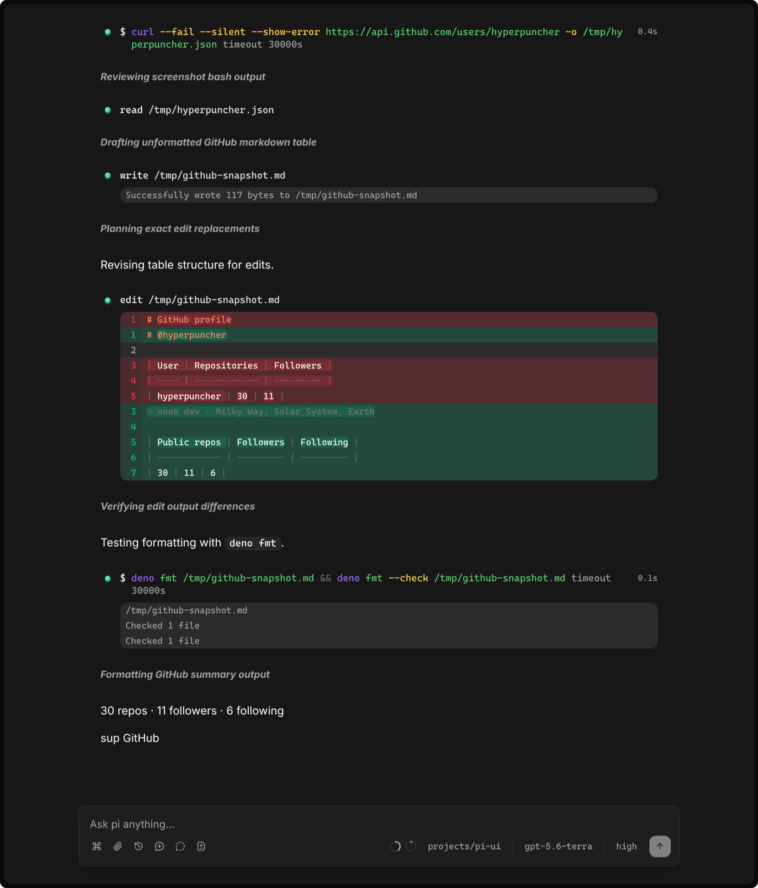

# pi-ui

keyboard-first desktop gui for [`pi`](https://pi.dev).

<div>
	<picture>
		<source
			srcset=".github/assets/screenshot-dark.png"
			media="(prefers-color-scheme: dark)"
		>
		<source
			srcset=".github/assets/screenshot-light.png"
			media="(prefers-color-scheme: light)"
		>
		
	</picture>
</div>

feature parity with the pi tui, plus desktop niceties like background sessions,
native notifications, file paste/drop, and rich code/diff rendering.

built with:

- [`deno-desktop`](https://docs.deno.com/runtime/desktop/)
- [`datastar`](https://data-star.dev/)
- [`kita-jsx`](https://github.com/kitajs/html)
- [`sätteri`](https://github.com/bruits/satteri)
- [`pierre-diffs`](https://diffs.com/)
- [`basecoat`](https://basecoatui.com/)

## install

### arch

```sh
paru -S pi-ui-bin
```

### mac

```sh
brew install --cask hyperpuncher/tap/pi-ui
```

## keybinds

| key              | action               |
| ---------------- | -------------------- |
| `ctrl/cmd+k`     | command menu         |
| `ctrl/cmd+o`     | new session          |
| `ctrl/cmd+alt+o` | temporary chat       |
| `ctrl/cmd+r`     | session picker       |
| `ctrl/cmd+l`     | model picker         |
| `alt+t`          | cycle thinking level |
| `alt+shift+t`    | cycle thinking back  |
| `/`              | slash commands       |
| `@`              | file picker          |
| `alt+enter`      | queue follow-up      |
| `alt+↑`          | restore queued text  |
| `j` / `k`        | scroll messages      |
| `gg` / `G`       | top / bottom         |
| `gi`             | focus prompt         |

## license

mit
