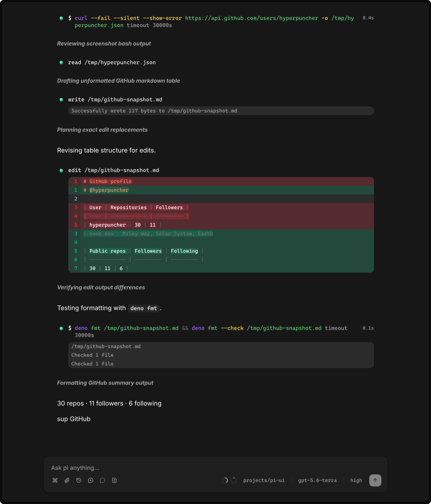

# pi-ui

keyboard-first minimal gui for [`pi`](https://pi.dev).

<div>
	<picture>
		<source
			srcset=".github/assets/screenshot-dark.png"
			media="(prefers-color-scheme: dark)"
		>
		<source
			srcset=".github/assets/screenshot-light.png"
			media="(prefers-color-scheme: light)"
		>
		
	</picture>
</div>

features:

- desktop and server apps
- background sessions and native notifications
- git review with commit history and inline comments
- markdown, syntax highlighting, and rich diffs
- file attachments with image previews

built with:

- [`deno-desktop`](https://docs.deno.com/runtime/desktop/)
- [`datastar`](https://data-star.dev/)
- [`kita-jsx`](https://github.com/kitajs/html)
- [`sätteri`](https://github.com/bruits/satteri)
- [`pierre-diffs`](https://diffs.com/)
- [`basecoat`](https://basecoatui.com/)

## install

> server mode is recommended for most users: it is lighter and runs in your existing browser

### server

use pi-ui in your browser without installing the desktop app. after installing, open [http://127.0.0.1:31415](http://127.0.0.1:31415)

#### quick install (linux / mac)

```sh
curl -fsSL https://pi-ui.app/install-server | sh
```

#### arch

```sh
paru -S pi-ui-server-bin
pi-ui-server autostart enable
```

#### mac

```sh
brew install hyperpuncher/tap/pi-ui-server
brew services start pi-ui-server
```

#### windows

```powershell
irm https://pi-ui.app/install-server.ps1 | iex
```

the windows installer starts pi-ui at login.

### desktop

#### quick install (linux / mac)

```sh
curl -fsSL https://pi-ui.app/install | sh
```

#### arch

```sh
paru -S pi-ui-bin
```

#### debian / ubuntu

download the `.deb` for your architecture from the [latest release](https://github.com/hyperpuncher/pi-ui/releases/latest), then:

```sh
sudo apt install ./pi-ui-linux-*.deb
```

#### other linux

download the `.AppImage` for your architecture from the [latest release](https://github.com/hyperpuncher/pi-ui/releases/latest), then:

```sh
chmod +x pi-ui-linux-*.AppImage
./pi-ui-linux-*.AppImage
```

#### mac

```sh
brew install --cask hyperpuncher/tap/pi-ui
```

## configuration

pi-ui stores its configuration in:

- linux: `~/.config/pi-ui/config.json`
- macos: `~/.config/pi-ui/config.json`
- windows: `%APPDATA%\\pi-ui\\config.json`

all options with their defaults:

```json
{
	"$schema": "https://pi-ui.app/config.schema.json",
	"autoTitle": {
		"enabled": true,
		"models": [
			"openai-codex/gpt-5.6-luna:minimal",
			"opencode-go/deepseek-v4-flash:off"
		],
		"prompt": "use lowercase"
	},
	"codeTheme": {
		"dark": "pierre-dark-soft",
		"light": "pierre-light"
	},
	"fonts": {
		"mono": "system",
		"sans": "system"
	},
	"gitView": {
		"changesRatio": 0.5,
		"gitPaneRatio": 0.5,
		"layout": "split",
		"mode": "all",
		"reviewSidebarWidth": 272,
		"tab": "git",
		"wrap": true
	},
	"keybindHints": true
}
```

## keybinds

| key                                                        | action                      |
| ---------------------------------------------------------- | --------------------------- |
| <kbd>ctrl/⌘</kbd> <kbd>k</kbd>                             | command palette             |
| <kbd>ctrl/⌘</kbd> <kbd>b</kbd>                             | toggle session sidebar      |
| <kbd>ctrl/⌘</kbd> <kbd>1–9</kbd>                           | switch session              |
| <kbd>ctrl/⌘</kbd> <kbd>o</kbd>                             | new session                 |
| <kbd>ctrl/⌘</kbd> <kbd>alt</kbd> <kbd>o</kbd>              | temporary chat              |
| <kbd>ctrl/⌘</kbd> <kbd>r</kbd>                             | session picker              |
| <kbd>ctrl/⌘</kbd> <kbd>/</kbd>                             | workspace picker            |
| <kbd>ctrl/⌘</kbd> <kbd>g</kbd>                             | toggle workspace            |
| <kbd>alt</kbd> <kbd>p</kbd>                                | focus prompt                |
| <kbd>alt</kbd> <kbd>c</kbd>                                | focus conversation          |
| <kbd>alt</kbd> <kbd>f</kbd>                                | focus workspace files       |
| <kbd>alt</kbd> <kbd>g</kbd>                                | focus git changes           |
| <kbd>alt</kbd> <kbd>e</kbd>                                | focus file or diff          |
| <kbd>alt</kbd> <kbd>s</kbd>                                | focus sessions              |
| <kbd>ctrl/⌘</kbd> <kbd>l</kbd>                             | model picker                |
| <kbd>ctrl/⌘</kbd> <kbd>p</kbd>                             | cycle favorite model        |
| <kbd>ctrl/⌘</kbd> <kbd>shift</kbd> <kbd>p</kbd>            | cycle favorite model back   |
| <kbd>alt</kbd> <kbd>t</kbd>                                | cycle thinking level        |
| <kbd>alt</kbd> <kbd>shift</kbd> <kbd>t</kbd>               | cycle thinking back         |
| <kbd>ctrl/⌘</kbd> <kbd>alt</kbd> <kbd>t</kbd>              | toggle thinking blocks      |
| <kbd>/</kbd>                                               | slash commands              |
| <kbd>@</kbd>                                               | file picker                 |
| <kbd>alt</kbd> <kbd>enter</kbd>                            | queue follow-up             |
| <kbd>alt</kbd> <kbd>↑</kbd>                                | restore queued text         |
| <kbd>j</kbd> / <kbd>k</kbd> or <kbd>↑</kbd> / <kbd>↓</kbd> | move or scroll focused pane |
| <kbd>gg</kbd> / <kbd>G</kbd>                               | top / bottom                |

## license

mit
