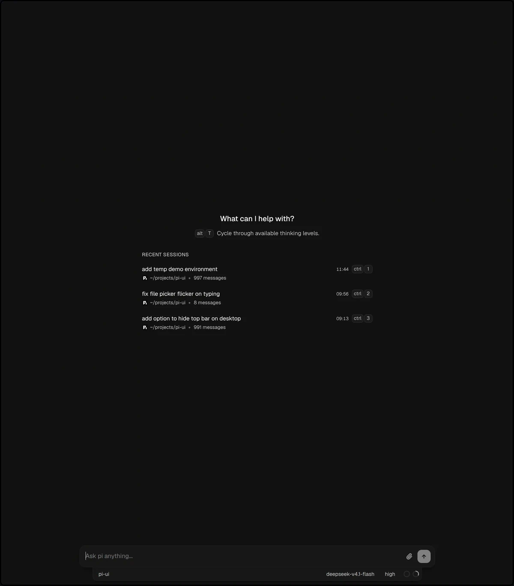

# pi-ui

keyboard-first minimal gui for [`pi`](https://pi.dev)

<div>
	<picture>
		<source
			srcset=".github/assets/demo-dark.webp"
			media="(prefers-color-scheme: dark)"
		>
		<source
			srcset=".github/assets/demo-light.webp"
			media="(prefers-color-scheme: light)"
		>
		
	</picture>
</div>

## features

- background sessions
- git review with commit history and inline comments
- markdown, syntax highlighting, and rich diffs
- file attachments with image previews
- a Live Workspace pane for turn state, sub-agents, usage, and extension activity
- full extension UI compatibility, including terminal-style `custom()` overlays

## built with

- [`pi`](https://github.com/earendil-works/pi)
- [`datastar`](https://data-star.dev/)
- [`kita-jsx`](https://github.com/kitajs/html)
- [`pierre-diffs`](https://diffs.com/)

## try

> requires bun 1.4+

```sh
bunx @hyperpuncher/pi-ui
```

## install

### quick install

> the quick installers start pi-ui in the background and at login

#### linux and macos

```sh
curl -fsSL https://pi-ui.app/install | sh
```

#### windows

```powershell
irm https://pi-ui.app/install.ps1 | iex
```

open [http://127.0.0.1:31415](http://127.0.0.1:31415) in your browser

### package managers

#### bun

> requires bun 1.4+

```sh
bun i -g @hyperpuncher/pi-ui
```

#### arch

```sh
paru -S pi-ui-bin
```

#### homebrew

```sh
brew install hyperpuncher/tap/pi-ui
```

> package-manager installs must be started with `pi-ui` or configured as a background service below

## background service

start pi-ui now and at login:

```sh
pi-ui service install
```

stop pi-ui and remove the service:

```sh
pi-ui service uninstall
```

### homebrew

homebrew manages the service separately:

```sh
brew services start pi-ui
brew services stop pi-ui
```

## development

> requires bun 1.4+

```sh
bun ci
bun run dev
```

## server options

pi-ui listens on `127.0.0.1:31415` by default. `pi-ui --help` prints every option; the ones
relevant to reaching pi-ui from another device (a phone, another computer on the same LAN):

```sh
pi-ui --host 0.0.0.0 --auth-token <a long random token>
```

- `--host <hostname>` / `PI_UI_HOST` — binds a specific interface. Anything other than
  `127.0.0.1`, `::1`, or `localhost` makes pi-ui reachable from other devices on that
  network — full access to your sessions, workspace files, and provider credentials.
- `--auth-token <token>` / `PI_UI_AUTH_TOKEN` — opt-in bearer token pi-ui then requires on
  every request. Without it, `--host` on anything but loopback is unauthenticated: pi-ui
  starts anyway (a warning is printed) but does **not** require one — pass a token whenever
  you bind beyond loopback. Open `http://<host>:<port>/?token=<token>` once per browser; a
  cookie remembers it after that, so links, the SSE stream, and later visits don't need it
  in the URL again.
- `--port <port>` / `PI_UI_PORT` — listen port.

## configuration

pi-ui stores its configuration in:

- linux: `~/.config/pi-ui/config.json`
- macos: `~/.config/pi-ui/config.json`
- windows: `%APPDATA%\pi-ui\config.json`

all options with their defaults:

```json
{
	"$schema": "https://pi-ui.app/config.schema.json",
	"autoTitle": {
		"enabled": true,
		"models": [
			"openai-codex/gpt-5.6-luna:minimal",
			"opencode-go/deepseek-v4.1-flash:off"
		],
		"prompt": "use lowercase"
	},
	"codeTheme": {
		"dark": "pierre-dark-soft",
		"light": "pierre-light"
	},
	"fonts": {
		"mono": "system",
		"sans": "system"
	},
	"gitView": {
		"changesRatio": 0.5,
		"gitPaneRatio": 0.5,
		"layout": "split",
		"mode": "all",
		"reviewSidebarWidth": 272,
		"tab": "git",
		"wrap": true
	},
	"keybindHints": true,
	"keybinds": {
		"new-chat": "ctrl o",
		"new-temporary-chat": "ctrl alt o",
		"resume-session": "ctrl r",
		"previous-session": "ctrl ^",
		"command-palette": "ctrl k",
		"toggle-minimal-mode": "alt m",
		"toggle-tool-output": "alt o",
		"switch-model": "ctrl l",
		"cycle-model": "ctrl p",
		"cycle-thinking": "alt t",
		"cycle-thinking-backward": "alt shift t",
		"toggle-thinking": "ctrl alt t",
		"toggle-review": "ctrl g",
		"change-workspace": "ctrl /",
		"cycle-model-backward": "ctrl shift p",
		"toggle-sessions": "ctrl b",
		"focus-prompt": "alt p",
		"focus-conversation": "alt c",
		"focus-sessions": "alt s",
		"focus-workspace-files": "alt f",
		"focus-workspace-changes": "alt g",
		"focus-workspace-editor": "alt e"
	},
	"minimalMode": false,
	"sessionSidebar": {
		"open": true,
		"width": 288
	},
	"toolOutputHidden": false,
	"toolbarHidden": false,
	"updateCheck": true
}
```

## keybinds

| key                                                        | action                      |
| ---------------------------------------------------------- | --------------------------- |
| <kbd>ctrl/⌘</kbd> <kbd>k</kbd>                             | command palette             |
| <kbd>alt</kbd> <kbd>p</kbd>                                | focus prompt                |
| <kbd>alt</kbd> <kbd>c</kbd>                                | focus conversation          |
| <kbd>alt</kbd> <kbd>f</kbd>                                | focus workspace files       |
| <kbd>alt</kbd> <kbd>g</kbd>                                | focus git changes           |
| <kbd>alt</kbd> <kbd>e</kbd>                                | focus file or diff          |
| <kbd>alt</kbd> <kbd>s</kbd>                                | focus sessions              |
| <kbd>j</kbd> / <kbd>k</kbd> or <kbd>↑</kbd> / <kbd>↓</kbd> | move or scroll focused pane |
| <kbd>gg</kbd> / <kbd>G</kbd>                               | top / bottom                |
| <kbd>ctrl/⌘</kbd> <kbd>o</kbd>                             | new session                 |
| <kbd>ctrl/⌘</kbd> <kbd>alt</kbd> <kbd>o</kbd>              | temporary chat              |
| <kbd>ctrl/⌘</kbd> <kbd>1–9</kbd>                           | switch session              |
| <kbd>ctrl/⌘</kbd> <kbd>^</kbd>                             | previous session            |
| <kbd>ctrl/⌘</kbd> <kbd>r</kbd>                             | session picker              |
| <kbd>ctrl/⌘</kbd> <kbd>b</kbd>                             | toggle session sidebar      |
| <kbd>ctrl/⌘</kbd> <kbd>/</kbd>                             | workspace picker            |
| <kbd>ctrl/⌘</kbd> <kbd>g</kbd>                             | toggle workspace            |
| <kbd>alt</kbd> <kbd>l</kbd>                                | toggle Live Workspace       |
| <kbd>ctrl/⌘</kbd> <kbd>l</kbd>                             | model picker                |
| <kbd>ctrl/⌘</kbd> <kbd>p</kbd>                             | cycle favorite model        |
| <kbd>ctrl/⌘</kbd> <kbd>shift</kbd> <kbd>p</kbd>            | cycle favorite model back   |
| <kbd>alt</kbd> <kbd>t</kbd>                                | cycle thinking level        |
| <kbd>alt</kbd> <kbd>shift</kbd> <kbd>t</kbd>               | cycle thinking back         |
| <kbd>ctrl/⌘</kbd> <kbd>alt</kbd> <kbd>t</kbd>              | toggle thinking blocks      |
| <kbd>alt</kbd> <kbd>m</kbd>                                | toggle minimal mode         |
| <kbd>alt</kbd> <kbd>o</kbd>                                | toggle tool output          |
| <kbd>/</kbd>                                               | slash commands              |
| <kbd>@</kbd>                                               | file picker                 |
| <kbd>alt</kbd> <kbd>enter</kbd>                            | queue follow-up             |
| <kbd>alt</kbd> <kbd>↑</kbd>                                | restore queued text         |

## live workspace

The Live Workspace pane (<kbd>alt</kbd> <kbd>l</kbd>, or the toolbar's activity icon) shows what
the agent is doing without leaving the chat: it docks as a resizable column on wide screens,
collapses to a right-side drawer on tablets, and becomes a bottom sheet on phones. Five tabs:

- **Now** — the current turn's phase (running, retrying with a countdown, compacting, or waiting
  on an extension's UI), active tools with live elapsed time and output previews, and any queued
  steering or follow-up messages.
- **Agents** — sub-agents, background shell jobs, and background sessions in one roster, plus
  on-demand read-only views into a `workflows` run journal and the delegate ledger, when present.
- **Usage** — session tokens, cost, cache-hit rate, the context-window meter, and any per-window
  provider quota limits.
- **Activity** — a bounded log of execution events (tool calls, turn boundaries, compaction,
  session changes) you can export as JSON or clear.
- **Extensions** — every PIUI element (widgets, rosters, progress, panels) and raw channel
  payload an extension has published, for extensions that don't render their own widget.

An opt-in bell toggle asks for permission to show a browser notification when a turn finishes or
starts waiting for input while the tab is hidden.

## extension compatibility

pi-ui binds pi SDK extensions as `"tui"` by default and renders their UI natively instead of a
terminal:

- Extensions that call `custom()`, `setWidget`, `setFooter`/`setHeader`, or read keyboard input
  through `onTerminalInput` get a **terminal surface**: a headless TUI host renders their ANSI
  output as themed HTML (light and dark) inside a dialog, or an inline panel above the editor (a
  footer or a below-editor widget renders after it instead), and forwards browser keys (including
  modifiers, arrows, and paste) back to the extension.
- Extensions gated on `ctx.mode === "tui"` (checking for terminal-only feature support — mcp/
  mcp-auth panels, bash-background and subagents key handling, the jev card, and similar) now see
  `"tui"` and work through the same terminal surface, instead of silently degrading to a text
  fallback.
- Extensions that speak the **PIUI bridge protocol** (`ctx.ui.notify("PIUI …")`) render as
  widgets, rosters, progress bars, markdown/diff panels, and native `<dialog>` sheets or forms,
  reusing pi-ui's own components — no per-extension code. Because `"tui"` binding alone would push
  these extensions onto their `custom()` fallback too (their own live-RPC-client check keys off
  the RPC family of modes), pi-ui sets the `PI_UI_BRIDGE=1` environment variable before any
  extension loads as a documented host-capability signal. A bridge helper opts in by honouring it
  at both of its gates — `bridgeIsLive()` returns `true` and its internal `isTui()` wire-delivery
  check returns `false` when `process.env.PI_UI_BRIDGE === "1"` (patching only the first leaves
  panels silently undelivered). Honour it only where the helper can round-trip an element: its
  `pi_ui_event` reverse channel is registered and it has a ui context to notify through.
  Otherwise the extension must keep its TUI path, or a blocking prompt such as `ask_user` is
  published into a void and waits forever. Nothing requires the marker: an extension that
  ignores it still works, as a terminal surface.
- Slash commands — every built-in plus every extension-registered command — get argument
  completions and native handling (pickers, dialogs, or notices) instead of being sent to the
  model as chat text.
- `extensions.mode` in the app config (`"tui"` by default, or `"rpc"`) is an escape hatch back to
  the pre-`"tui"` binding, for the unlikely case a `ctx.mode === "tui"`-gated extension assumes a
  real terminal process in a way the terminal surface shim doesn't cover.

### known gaps

- **bash-background / subagents on Windows can fail to launch a real shell under Bun.** The
  bash-background extension's own `console-bash.ts` spawns its shell through node-pty's ConPTY
  backend (`useConpty: true`) so descendant processes share one invisible console instead of
  flashing a Windows Terminal window per command. When pi-ui's Bun host is the process that makes
  that `node-pty` call, the child exits immediately with code `-1073741510`
  (`STATUS_CONTROL_C_EXIT`, an unhandled Ctrl+C/Break) before producing any output, so every
  Windows `/bg` command fails. This is a Bun/node-pty ConPTY incompatibility, not a pi-ui
  regression, and pi-ui itself never calls node-pty — only this extension does, in-process — so
  there is no generic, safe fix pi-ui can apply to how it launches its own process.

    Isolated with a minimal, standalone repro against the extension's own node-pty build, varying
    only one thing at a time:
    - Bun parent + ConPTY (`useConpty: true`), any child (`cmd.exe`, or `bun.exe` itself as the
      child) — the child dies immediately with `STATUS_CONTROL_C_EXIT`, before emitting anything
      beyond ConPTY's own initial VT handshake bytes. Reproduces identically under `bun run` and
      under a `bun build --compile`'d executable, so it is not a dev-mode-only quirk.
    - Node parent, same machine, same node-pty build, same non-console shell, same ConPTY backend,
      same children (including `bun.exe` as the ConPTY-attached child) — works, exit `0`, real
      output captured.
    - Bun parent + node-pty's older winpty backend (`useConpty: false`) — works, exit `0`, real
      output captured, under both `bun run` and the compiled executable.

    Every case above has the same lack of an attached Win32 console (`process.stdout.isTTY` and
    `process.stdin.isTTY` are `undefined` throughout), which rules out "no attached console" as the
    cause: winpty needs no console either, and it works fine under Bun in the exact same shell.
    Swapping which end is Bun (a Node parent spawning `bun.exe` as its ConPTY-attached child)
    succeeds, which further isolates the failure to Bun specifically being the _parent_ process that
    calls node-pty's native `startProcess()` — not to Bun appearing anywhere in the process tree.

    A verified, unapplied patch for the extension exists (falling back to `useConpty: false` only
    when hosted under Bun, leaving a real Node-hosted `pi` CLI's own ConPTY path untouched) for
    anyone maintaining that extension to review and apply to their own `~/.pi/agent` at their
    discretion; it lives outside this repository, alongside the rest of this investigation's
    scratch work, and pi-ui does not apply it itself. A durable, in-scope fix would host node-pty in
    a small Node subprocess pi-ui launches once and talks to over a pipe, but that is a meaningfully
    larger change than this round covers and is left for a future round.

- **Extension message/entry renders keep the width they were made at.** Output from
  `registerMessageRenderer`/`registerEntryRenderer` is rendered once, at the narrowest transcript
  width any connected tab has reported, when the message arrives or the session loads. Resizing a
  window, or connecting a narrower tab, does not redraw messages that are already in the
  transcript; they re-render at the new width the next time the session loads. Light/dark changes
  need no redraw because the colors are pi-ui theme tokens.

## mobile and Capacitor wrapping

pi-ui's shell is built to drop into a Capacitor WebView with no code changes:

- `viewport-fit=cover` plus `env(safe-area-inset-*)` padding on the toolbar, prompt box, dialogs,
  the session sidebar, and the Live Workspace sheet/drawer keep content clear of notches and home
  indicators.
- Every interactive control reaches a real 44px hit area under `(pointer: coarse)`, dismissible
  surfaces don't rely on hover, and the prompt doesn't steal focus (and the keyboard) on a cold
  start on a coarse pointer.
- Opening a dialog, the session sidebar drawer, or the Live Workspace sheet pushes a browser
  history entry (`static/app/history-stack.js`); closing it (Escape, a Cancel button, the
  backdrop, or a hardware/gesture back press) pops exactly that entry. Capacitor's `App` plugin
  falls back to `window.history.back()` for the Android back button, so this makes it close the
  top-most surface instead of leaving the app on the first press — with no Capacitor-specific code.
- `static/manifest.webmanifest` ships maskable + any-purpose icons and `"orientation": "any"` for
  an installable/wrapped shell.
- The SSE `/stream` connection sends a periodic heartbeat and the client forces a reconnect on
  `visibilitychange`, `pageshow`, and `online`, so backgrounding the WebView and returning doesn't
  leave the UI stale.
- To reach pi-ui from a Capacitor shell talking to a separate host process (rather than bundling
  the server), bind non-loopback with `--auth-token` — see [server options](#server-options).

## license

mit
